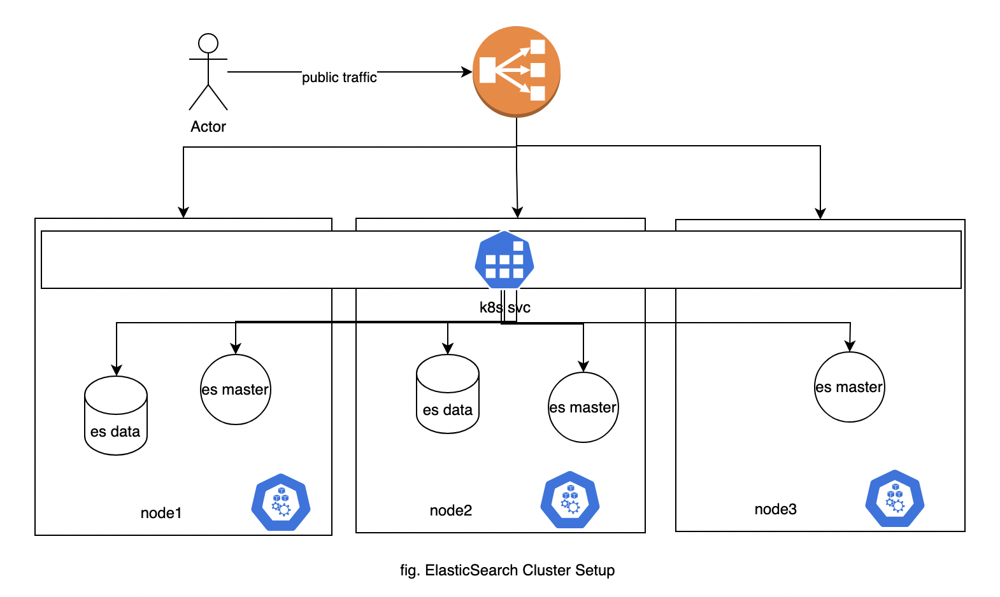

## Overview
This guide provides the information for deploying/managing highly available Elastic search setup in EKS using `Elastic Cloud on Kubernetes Operator`. In this we will see how we can  deploy Elasticsearch version `8.8.1` using the ECK Operator.

The major source of information for this guide is the [official ECK docs](https://www.elastic.co/guide/en/cloud-on-k8s/current/k8s-overview.html).

This README only contains the playbook to deploy elasticsearch, Please find out more about the technical decisions and elastic search configuration follow the links below:
- [Technical decisions](./Decisions.md)
- [Kind ElasticSearch](./elasticsearch.yaml)

#### Why ECK Operator?
We will be deploying/managing the Elasticsearch using the Elastic Cloud on Kubernetes Operator which is the latest recommended approach and managed by the elastic team, community itself. Please find more [details here](https://www.elastic.co/guide/en/cloud-on-k8s/current/k8s-overview.html).

#### Architecture
The current setup will create elastic search with 3 master nodes and 2 data nodes and make them accessible via LoadBalancer in AWS EKS. It tries to distribute the elastic search nodes evenly among the existing k8s worker nodes.


## Pre-requisite
### 1. EKS Cluster ☸️
The setup assumes that EKS cluster is up and running and has enough resource to provision the ES Cluster. The current setup creates `3 master nodes` and `2 data nodes` which requires approx `2GB` memory and `1 vCPU` per elasticsearch node.

### 2. Install ECK CRDs ☸️
Install custom resources for provisioning the `kind: ElasticSearch` resource. It creates other Custom Resources supported by ECK as well but can be ignored. 
Command
```shell
kubectl create -f https://download.elastic.co/downloads/eck/2.8.0/crds.yaml
```
Output
```shell
customresourcedefinition.apiextensions.k8s.io/agents.agent.k8s.elastic.co created
customresourcedefinition.apiextensions.k8s.io/apmservers.apm.k8s.elastic.co created
customresourcedefinition.apiextensions.k8s.io/beats.beat.k8s.elastic.co created
customresourcedefinition.apiextensions.k8s.io/elasticmapsservers.maps.k8s.elastic.co created
customresourcedefinition.apiextensions.k8s.io/elasticsearchautoscalers.autoscaling.k8s.elastic.co created
customresourcedefinition.apiextensions.k8s.io/elasticsearches.elasticsearch.k8s.elastic.co created
customresourcedefinition.apiextensions.k8s.io/enterprisesearches.enterprisesearch.k8s.elastic.co created
customresourcedefinition.apiextensions.k8s.io/kibanas.kibana.k8s.elastic.co created
customresourcedefinition.apiextensions.k8s.io/logstashes.logstash.k8s.elastic.co created
customresourcedefinition.apiextensions.k8s.io/stackconfigpolicies.stackconfigpolicy.k8s.elastic.co created
```

### 3. Install Operator with its RBAC rules ☸️
The below command installs operator and required roles to manage various operations. By default it creates `elastic-system` namespace and deploys resources under it. 
Command
```shell
kubectl apply -f https://download.elastic.co/downloads/eck/2.8.0/operator.yaml
```

Output
```shell
namespace/elastic-system created
serviceaccount/elastic-operator created
secret/elastic-webhook-server-cert created
configmap/elastic-operator created
clusterrole.rbac.authorization.k8s.io/elastic-operator created
clusterrole.rbac.authorization.k8s.io/elastic-operator-view created
clusterrole.rbac.authorization.k8s.io/elastic-operator-edit created
clusterrolebinding.rbac.authorization.k8s.io/elastic-operator created
service/elastic-webhook-server created
statefulset.apps/elastic-operator created
validatingwebhookconfiguration.admissionregistration.k8s.io/elastic-webhook.k8s.elastic.co created
```

#### Verify ☑️
Verify if the operator is up and running by looking at the logs.
Command
```shell
kubectl -n elastic-system logs -f statefulset.apps/elastic-operator
```

Output
```shell
{"log.level":"info","@timestamp":"2023-06-19T04:38:33.355Z","log.logger":"manager.eck-operator","message":"Starting EventSource","service.version":"2.8.0+3940cf4d","service.type":"eck","ecs.version":"1.4.0","controller":"beat-controller","source":"kind source: *v1.Secret"}
{"log.level":"info","@timestamp":"2023-06-19T04:38:33.355Z","log.logger":"manager.eck-operator","message":"Starting EventSource","service.version":"2.8.0+3940cf4d","service.type":"eck","ecs.version":"1.4.0","controller":"beat-controller","source":"kind source: *v1.Secret"}
{"log.level":"info","@timestamp":"2023-06-19T04:38:33.355Z","log.logger":"manager.eck-operator","message":"Starting Controller","service.version":"2.8.0+3940cf4d","service.type":"eck","ecs.version":"1.4.0","controller":"beat-controller"}
...
```

### 4. Storage Class (Optional) ☸️
This is optional step as the `elasticsearch.yaml` manifest is configured to use the default `gp2` `storage class`. If you want to override this behavior you can create your custom storage class and update its name in the `elasticsearch.yaml` file.

**NOTE:** Make sure the `EBS CSI Plugin`is active and the EKS Nodes have permission to manage volumes on behalf of provisioner. Please include the following policy if missing.
```json
{
  "Version": "2012-10-17",
  "Statement": [
    {
      "Effect": "Allow",
      "Action": [
        "ec2:AttachVolume",
        "ec2:CreateSnapshot",
        "ec2:CreateTags",
        "ec2:CreateVolume",
        "ec2:DeleteSnapshot",
        "ec2:DeleteTags",
        "ec2:DeleteVolume",
        "ec2:DescribeAvailabilityZones",
        "ec2:DescribeInstances",
        "ec2:DescribeSnapshots",
        "ec2:DescribeTags",
        "ec2:DescribeVolumes",
        "ec2:DescribeVolumesModifications",
        "ec2:DetachVolume",
        "ec2:ModifyVolume"
      ],
      "Resource": "*"
    }
  ]
}      
```

#### Verify ☑️
Verify if the EBS CSI controller is actively running.
Command
```shell
kubectl get pods -n kube-system -lapp=ebs-csi-controller
``
Output
```shell
NAME                                 READY   STATUS    RESTARTS   AGE
ebs-csi-controller-6876d9b86-d88kq   6/6     Running   0          5m49s
ebs-csi-controller-6876d9b86-t47wn   6/6     Running   0          5m49s
```

## Deploy Elasticsearch ☸️
Now as our pre-requisite is met we can deploy the elastic search in the cluster using `elasticsearch.yaml` template

#### 1. Apply ⤵️
```shell
k apply -f elasticsearch.yaml
```

#### 2. Verify ☑️
Verify by listing the elasticsearch resources

**Initial Status**
```shell
#When you create the cluster, there is unknown HEALTH status and the PHASE is ApplyingChanges. After a while, the PHASE turns into Ready, and HEALTH becomes green.
➜ kubectl get es  
NAME     HEALTH    NODES   VERSION   PHASE             AGE
esearch   unknown           8.8.1     ApplyingChanges   22s

➜ kubectl get pods
NAME                  READY   STATUS     RESTARTS   AGE
esearch-es-data-0      0/1     Init:0/3   0          23s
esearch-es-data-1      0/1     Init:0/3   0          23s
esearch-es-masters-0   0/1     Init:0/3   0          23s
esearch-es-masters-1   0/1     Init:0/3   0          23s
esearch-es-masters-2   0/1     Init:0/3   0          23s

➜ kubectl get sts 
NAME                READY   AGE
esearch-es-data      0/2     28s
esearch-es-masters   0/3     29s
➜  elastic-search git:(main) ✗ 

```

**Eventual Status**
```shell
➜ kubectl get es
NAME     HEALTH   NODES   VERSION   PHASE   AGE
esearch   green    5       8.8.1     Ready   3m5s

➜ kubectl get pods
NAME                  READY   STATUS    RESTARTS   AGE
esearch-es-data-0      1/1     Running   0          3m10s
esearch-es-data-1      1/1     Running   0          3m10s
esearch-es-masters-0   1/1     Running   0          3m10s
esearch-es-masters-1   1/1     Running   0          3m10s
esearch-es-masters-2   1/1     Running   0          3m10s

➜ kubectl get sts
NAME                READY   AGE
esearch-es-data      2/2     3m16s
esearch-es-masters   3/3     3m17s
```

#### 3. Accessing 🌍
To access the cluster properly you will need `es endpoint`, `es password` and the `ca certificate`. Please use below commands to get the information:

```shell
#Set Elasticsearch name
export ES_NAME=esearch

#Get Service Public endpoint
ENDPOINT=$(kubectl get svc ${ES_NAME}-es-http -o jsonpath='{.status.loadBalancer.ingress[0].hostname}')

#Get ElasticSearch User Password
PASSWORD=$(kubectl get secret ${ES_NAME}-es-elastic-user -o go-template='{{.data.elastic | base64decode}}')

#Get ES CA Certificate
kubectl get secret ${ES_NAME}-es-http-certs-public -o go-template='{{index .data "tls.crt" | base64decode }}' > ca.cert
```
#### Verify ☑️
Once we have endpoint, certificates and password we can not connect with elasticsearch cluster using https. Please use the below verification command to see if everything is set properly.
Command
```shell
curl -X GET --cacert ca.cert -u "elastic:${PASSWORD}" "https://${ENDPOINT}:9200"
```
Output
```shell
{
  "name" : "esearch-es-masters-2",
  "cluster_name" : "esearch",
  "cluster_uuid" : "jygZP_KOS_6ELM5WjSe9cQ",
  "version" : {
    "number" : "8.8.1",
    "build_flavor" : "default",
    "build_type" : "docker",
    "build_hash" : "f8edfccba429b6477927a7c1ce1bc6729521305e",
    "build_date" : "2023-06-05T21:32:25.188464208Z",
    "build_snapshot" : false,
    "lucene_version" : "9.6.0",
    "minimum_wire_compatibility_version" : "7.17.0",
    "minimum_index_compatibility_version" : "7.0.0"
  },
  "tagline" : "You Know, for Search"
}
```

## Cleanup ❌
If we need to revert all the changes we can do in following order.
```shell
kubectl delete -f elasticsearch.yaml
kubectl delete -f https://download.elastic.co/downloads/eck/2.8.0/operator.yaml
kubectl delete -f https://download.elastic.co/downloads/eck/2.8.0/crds.yaml
```
Hurray :tada: this concludes the setup of the elastic search using the ECK operator. For any further details and customization please follow details section below.

## Further configuration and details 📖
There are many more settings that can be configured to tune the cluster setup to our needs. Please find more details in this [API reference](https://www.elastic.co/guide/en/cloud-on-k8s/current/k8s-api-elasticsearch-k8s-elastic-co-v1.html).

